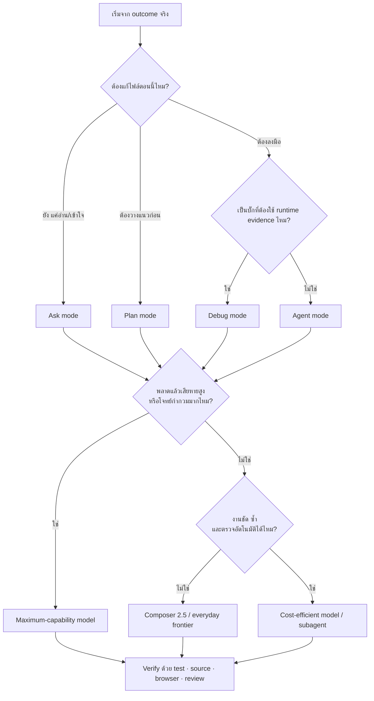
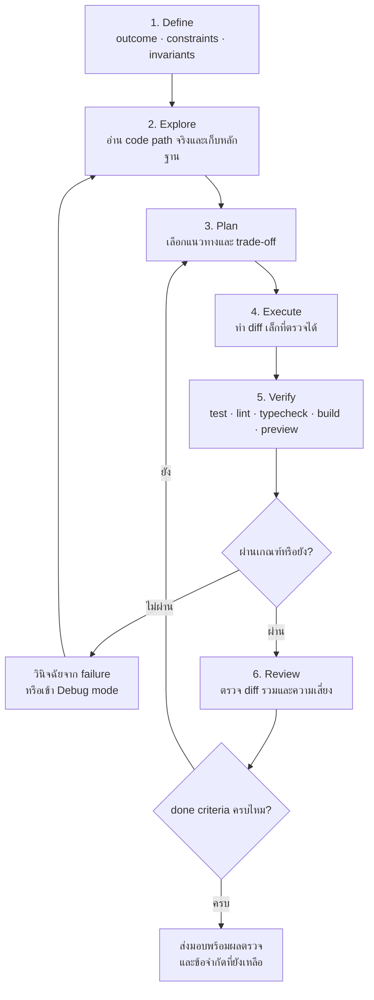

# ใช้ Cursor ให้เต็มประสิทธิภาพ

> **หลักเดียวที่ต้องจำ:** เลือก *โหมด* ก่อน แล้วค่อยเลือก *โมเดล* ตามความเสี่ยงของงาน
>
> ทุ่มความฉลาดตรงที่พลาดแล้วเจ็บ — ประหยัดตรงที่พลาดแล้วแก้ง่าย
> เครื่องมือรอบตัว (Rules / Skills / @ / Plan) สำคัญกว่าการไล่เปลี่ยนโมเดลทุกนาที

คู่มือนี้อธิบายวิธีเลือก **พื้นผิวการทำงาน โหมด โมเดล และเครื่องมือประกอบ** ของ Cursor สำหรับงานพัฒนา software โดยเน้นการแลกกันระหว่างคุณภาพ ความเร็ว ต้นทุน และความเสี่ยง ไม่ได้สมมติว่าโมเดลใดดีที่สุดกับทุกงาน

เป็นคู่มือพี่น้องกับ [how-to-use-gpt](https://github.com/zgame555/how-to-use-gpt) และใช้โครงคิดแบบเดียวกัน: เริ่มจาก outcome และความเสียหายที่ยอมรับได้ แล้วค่อยเลือกวิธีที่ถูกและเร็วที่สุดซึ่งยังผ่านการตรวจจริง

ข้อมูลผลิตภัณฑ์และราคาอัปเดตล่าสุด: **2 สิงหาคม 2026** — ชื่อโมเดล ราคา availability และ UI เปลี่ยนได้เสมอ โปรดตรวจ [Models & Pricing](https://cursor.com/docs/models-and-pricing) และ model picker ของบัญชีคุณก่อนตัดสินใจเรื่องงบประมาณ

---

## สารบัญ

1. [รู้จักชุดเครื่องมือของคุณ](#1-รู้จักชุดเครื่องมือของคุณ)
2. [เลือกโหมดและโมเดลภายใน 30 วินาที](#2-เลือกโหมดและโมเดลภายใน-30-วินาที)
3. [สลับโหมดและโมเดลอย่างไร](#3-สลับโหมดและโมเดลอย่างไร)
4. [คันโยกที่สำคัญกว่าการเปลี่ยนโมเดล](#4-คันโยกที่สำคัญกว่าการเปลี่ยนโมเดล)
5. [สูตรทำงานที่ใช้ได้กับทุกโปรเจกต์](#5-สูตรทำงานที่ใช้ได้กับทุกโปรเจกต์)
6. [เลือกตามสายงาน](#6-เลือกตามสายงาน)
7. [เคสจริง](#7-เคสจริง)
8. [สัญญาณว่าเลือกโหมดหรือโมเดลผิด](#8-สัญญาณว่าเลือกโหมดหรือโมเดลผิด)
9. [เรื่องที่เข้าใจผิดบ่อย](#9-เรื่องที่เข้าใจผิดบ่อย)
10. [กฎสำหรับงานเสี่ยงสูง](#10-กฎสำหรับงานเสี่ยงสูง)
11. [มุมมองแบบ senior](#11-มุมมองแบบ-senior)
12. [Cheat sheet](#12-cheat-sheet)
13. [แหล่งอ้างอิงทางการ](#13-แหล่งอ้างอิงทางการ)

---

## 1. รู้จักชุดเครื่องมือของคุณ

Cursor ไม่ใช่แค่แชทกับโมเดล แต่เป็นเวิร์กสเตชันที่มี 4 ชั้นให้เลือก:

```
ชั้นที่ 1  พื้นผิว (Surface)  →  ทำงานหน้าเครื่อง, ใน terminal หรือบน cloud?
ชั้นที่ 2  โหมด (Mode)       →  อ่าน, วางแผน, ลงมือ หรือไล่ runtime?
ชั้นที่ 3  โมเดล (Model)     →  งานนี้กำกวมและเสี่ยงแค่ไหน?
ชั้นที่ 4  คันโยก (Leverage) →  Rules / Skills / @ / MCP / Subagent / Browser / Cloud
```

คนมือใหม่มักเริ่มจากชื่อโมเดล ซีเนียร์เริ่มจากลักษณะงานและวิธีพิสูจน์ผล แล้วค่อยใช้โมเดลเท่าที่จำเป็น

### 1.1 สามพื้นผิวหลัก

| พื้นผิว | เหมาะกับ | จุดเด่น |
|---|---|---|
| **Editor Agent** | ทำงานโต้ตอบกับ repo, UI และ terminal | เห็น diff, checkpoints, browser และถามตอบระหว่างทาง |
| **Cursor CLI** | ทำงานจาก terminal, script และ CI | ใช้ `agent`, เลือก mode/model, resume, worktree และ output แบบ JSON ได้ |
| **Cloud Agents** | งานยาว งานขนาน หรืออยากปิดเครื่อง | รันบน VM/branch แยก ติดตามต่อจากเว็บหรือมือถือได้ |

เลือกพื้นผิวตามการประสานงาน ไม่ใช่ความยากอย่างเดียว: งานยากที่ต้องตอบคำถามทุก 2 นาทีอาจเหมาะกับ Editor มากกว่า Cloud ส่วนงานชัดที่ใช้เวลา 40 นาทีอาจเหมาะกับ Cloud แม้ logic ไม่ซับซ้อน

### 1.2 สี่โหมดหลัก

สลับด้วย **Shift+Tab** หรือ mode picker การสลับโหมดใน chat เดิมยังใช้บทสนทนาเดิม; ถ้าเปลี่ยน outcome หลักหรือบริบทเริ่มรก ให้เปิด chat ใหม่เอง

| โหมด | แก้ไฟล์? | บทบาท | ใช้เมื่อ |
|---|---|---|---|
| **Agent** | ใช่ | ✋ มือ | งานส่วนใหญ่ — เขียน แก้ รันเทสต์ refactor |
| **Ask** | ไม่ | 👁 ตา | อ่านอย่างเดียว เข้าใจระบบก่อนลงมือ |
| **Plan** | หลัง approve | 🧠 สมอง | งานหลายไฟล์ / scope ไม่ชัด / ต้องเลือกสถาปัตย์ |
| **Debug** | ใช่ | 🔎 นักสืบ | บั๊กยาก ต้องมี runtime evidence ไม่เดาแก้ |

**ลำดับที่ถูกต้องบ่อยที่สุด:**

```
Ask เข้าใจ  →  Plan วางแผน  →  Agent ลงมือ  →  Debug เมื่อติดจริง
```

อย่าเปิด Agent แล้วสั่ง “ทำให้ระบบดีขึ้น” ลอย ๆ ระบุ outcome, scope, ข้อห้าม และวิธีตรวจให้ครบก่อน

### 1.3 ทีมโมเดล ณ วันที่อัปเดต

Cursor มีทั้งโมเดลของตัวเองและโมเดล third-party รายชื่อจริงขึ้นกับ plan, region, workspace policy และ model picker

| กลุ่ม | ตัวอย่างปัจจุบัน | จุดเริ่มต้นที่เหมาะ |
|---|---|---|---|
| **Cursor Models** | Composer 2.5, Grok 4.5 | Composer สำหรับ agentic coding ประจำวัน; Grok สำหรับงานยากและยาวที่อยากอยู่พูล Cursor |
| **Everyday frontier** | Claude Sonnet 5, GPT-5.6 Terra, Gemini 3.6 Flash | งานทั่วไปที่ยังต้อง reasoning, tools และความน่าเชื่อถือสูง |
| **Maximum capability** | Claude Fable 5 / Opus 5, GPT-5.6 Sol, Gemini 3.1 Pro | architecture, debug ยาก, งานกำกวม หรือพลาดแล้วเสียหายสูง |
| **Cost / volume** | GPT-5.6 Luna และรุ่นเล็กที่บัญชีคุณมี | งานชัด ซ้ำ ตรวจอัตโนมัติได้ และมีปริมาณมาก |
| **Auto** | Cost / Balance / Intelligence | ให้ Cursor Router เลือกโมเดลตามจุดแลกระหว่างราคาและความสามารถ |

จำแบบไม่ผูกตัวเองกับชื่อรุ่น:

```text
default       = โมเดลประจำวันในพูลที่คุ้มกับบัญชีคุณ
escalate      = ขึ้นรุ่นเมื่อกำกวม ติดยาก หรือพลาดแล้วเจ็บ
downshift     = ลงรุ่นเมื่องานชัด ซ้ำ และมี test/validation คุม
verify        = compiler, test, browser และ source เป็นผู้ตัดสิน ไม่ใช่ราคาโมเดล
```

- **Composer 2.5 Fast** เป็นค่าเริ่มต้นในผลิตภัณฑ์; standard ช้ากว่าแต่ประหยัดกว่า
- **Grok 4.5** เป็นโมเดลความสามารถสูงในพูล Cursor Models สำหรับงาน agentic ระยะยาว
- **Sonnet 5** เป็น third-party default ที่สมดุลเมื่ออยากได้ reasoning ใกล้รุ่นบนในราคาต่ำกว่า
- **Fable 5 ไม่ใช่โมเดลงานคำโดยเฉพาะ** แต่เป็นรุ่นบนสำหรับ coding/knowledge work และมีข้อกำหนด data retention ที่องค์กรต้องพิจารณา
- การส่ง Plan ให้รุ่นบน แล้วเปลี่ยน agent ใหม่มาลงมือไม่ฟรี: agent ใหม่ต้องอ่านบริบทอีกครั้ง ถ้าตัวเดิมทำต่อได้และผลผ่าน ก็ไม่จำเป็นต้องสลับ

### 1.4 ราคาและพูลการใช้งาน

แผน Pro ขึ้นไปมี **สองพูลรายเดือน** ซึ่งรีเซ็ตตามรอบบิล:

| พูล | รวมอะไร | ใช้เมื่อ |
|---|---|---|
| **Cursor Models** | Composer 2.5, Grok 4.5 | งานประจำวัน — พูลนี้ใหญ่กว่า |
| **Other Models** | Claude / GPT / Gemini ฯลฯ | เมื่อต้องการจุดแข็งเฉพาะรุ่น · หักตาม API rate ของรุ่นนั้น |

ราคา individual ณ วันที่อัปเดต:

| แผน | ราคา | Other Models ที่รวม | เหมาะกับ |
|---|---:|---:|---|
| Hobby | ฟรี | — | ทดลองใช้แบบจำกัด |
| Start (อินเดีย) | ₹649/เดือน | $0 | ใช้ Cursor Models เป็นหลัก |
| Pro | $20/เดือน | $20 | Agent รายวันระดับทั่วไป |
| Pro Plus | $60/เดือน | $70 | ใช้ Agent และ third-party หนักขึ้น |
| Ultra | $200/เดือน | $400 | power user, หลาย agent หรือ automation |

Teams มี Standard $40/ผู้ใช้/เดือน และ Premium $120/ผู้ใช้/เดือน; Cursor Router แบบ **Auto Cost / Balance / Intelligence** ออกแบบสำหรับ Teams และ Enterprise

**อ่านตารางนี้ยังไง:**

- งานประจำวันส่วนใหญ่ควรอยู่ใน **Cursor Models** ก่อน — อย่าเผา Other Models กับ rename/CSS
- โดยทั่วไป output แพงกว่า input หลายเท่า ต้นทุนจริงจึงมาจากทั้ง context, reasoning/output และจำนวน tool rounds
- เกินโควตา → เปิด on-demand หรืออัปเกรด — Cursor **ไม่ลดคุณภาพ request** ให้แอบๆ
- Auto Cost ใช้พูล first-party; Auto Balance/Intelligence อาจ route ไป third-party และหักตามรุ่นจริง

> ราคาและรายชื่อโมเดลเปลี่ยนบ่อย — ใช้ `agent --list-models` หรือ model picker เป็นแหล่งจริงของบัญชีคุณ

### 1.5 เครื่องมือรอบตัวที่ต้องรู้จักชื่อ

| เครื่องมือ | คืออะไร | ที่อยู่ |
|---|---|---|
| **Tab** | autocomplete ระหว่างพิมพ์ (คนละโมเดลกับ Agent) | พิมพ์ในไฟล์ → กด Tab รับ |
| **Inline Edit** | แก้จุดเดียวในที่ | เลือกโค้ด → **Cmd/Ctrl+K** |
| **Agent** | ลงมือหลายไฟล์ + เทอร์มินัล | **Cmd/Ctrl+I** |
| **Rules** | คำสั่งถาวรให้ Agent | `.cursor/rules/*.mdc`, `AGENTS.md` |
| **Skills** | workflow พร้อมใช้ เรียกด้วย `/` หรือให้ agent หยิบเอง | `.agents/skills/`, `.cursor/skills/` และแบบ user-level |
| **MCP** | ต่อเครื่องมือภายนอก (DB, Figma, GitHub…) | `.cursor/mcp.json` |
| **Hooks** | สคริปต์แทรกก่อน/หลัง agent ทำอะไร | `.cursor/hooks.json` |
| **Subagents** | ตัวย่อย context แยก รันขนานได้ | `.cursor/agents/` |
| **Cloud Agents** | agent บน VM แยก ปิดแล็ปได้ | dropdown Cloud / cursor.com/agents |
| **Bugbot** | รีวิว PR อัตโนมัติ | GitHub integration |

---

## 2. เลือกโหมดและโมเดลภายใน 30 วินาที

ถาม 5 ข้อนี้ตามลำดับ:

1. **ตอนนี้ต้องแก้ไฟล์หรือยัง?** ยังต้องเข้าใจระบบ → Ask; มีหลายแนวทางหรือหลายระบบ → Plan
2. **เป็นบั๊กที่อ่านโค้ดแล้วยังไม่รู้เหตุ หรือขึ้นกับ timing/runtime ไหม?** → Debug
3. **พลาดแล้วเสียหายสูงไหม?** เงิน สิทธิ์ ข้อมูล production หรือ migration ที่ย้อนยาก → โมเดลความสามารถสูงสุดที่คุณมี
4. **เป็นงาน agentic ทั่วไปที่ต้องอ่านไฟล์ ใช้ tools และตรวจผลไหม?** → เริ่ม Composer 2.5 หรือ everyday frontier
5. **งานชัด ซ้ำ และตรวจด้วย test/schema ได้ไหม?** → ทดลองรุ่นเล็กหรือ subagent หลังมีตัวอย่างที่ผ่านแล้ว



| ลักษณะงาน | โหมดเริ่มต้น | ระดับโมเดลเริ่มต้น | หลักฐานจบงาน |
|---|---|---|---|
| ถามว่าโค้ดทำงานอย่างไร | Ask | ประหยัด–กลาง | อ้างไฟล์และเส้นทางจริง |
| feature เล็ก สเปคชัด | Agent | Composer / everyday | test, lint หรือ preview |
| feature หลายไฟล์หรือ requirement ยังไม่นิ่ง | Plan → Agent | รุ่นบนตอนตัดสินใจ; everyday ตอนลงมือ | plan ที่อนุมัติ + test/build |
| บั๊กยาก/race/performance | Debug | รุ่นบน | reproduce → runtime evidence → regression test |
| refactor ตาม pattern ที่พิสูจน์แล้ว | Agent + subagent | ประหยัด–กลาง | typecheck/build/test รวม |
| auth/payment/data migration | Plan → Agent/Debug | รุ่นบน | invariant, dry run, approval, rollback |

หลักสำคัญคือ **เลือก mode จากสิ่งที่ต้องทำ เลือก model จาก judgment ที่ต้องใช้ และเลือก verification จากสิ่งที่อาจพัง**

---

## 3. สลับโหมดและโมเดลอย่างไร

คู่มือทั้งเล่มไร้ค่าถ้าสลับไม่เป็น มี 4 ระดับ:

**ระดับโหมด — สำคัญที่สุด**

```
Shift+Tab          สลับ Agent ↔ Plan ↔ Ask (และ Debug ตาม UI)
Mode picker        เลือกตรงๆ เหนือช่องพิมพ์
```

กฎ: **เปลี่ยน outcome หรือเปลี่ยนโมดูลหลัก = เริ่ม chat ใหม่** แต่เปลี่ยนจาก Ask → Plan → Agent ใน outcome เดิมได้โดยใช้ chat เดิม

**ระดับเซสชัน — เปลี่ยนโมเดลตัวหลัก**

```
Model picker บนแชท     เลือกโมเดลสำหรับบทสนทนานี้ต่อไป
Cmd+/ (Mac)            วนโมเดล
Cursor Settings → Models   ตั้งค่า default
```

สลับกลางคันได้ เช่น สำรวจด้วยโมเดลเร็ว → สลับโมเดลฉลาดตอน implement

**ระดับ CLI — ใช้ในเทอร์มินัล**

```bash
agent --model composer-2.5
agent --list-models
agent --mode=plan "ออกแบบ auth flow"
```

ในเซสชัน CLI: พิมพ์ `/model`, `/plan`, `/ask`, `/debug`, `/summarize`

**ระดับ subagent — แยกงานที่ต้องการ context หรือ workstream ของตัวเอง**

สร้างไฟล์ `.cursor/agents/test-writer.md`:

```markdown
---
name: test-writer
description: เขียน unit test ตาม spec ที่ให้ ใช้กับไฟล์ที่ logic ตรงไปตรงมา
model: composer-2.5
---

เขียนเทสต์ตามแพทเทิร์นที่มีอยู่ในโปรเจกต์ ห้ามแก้โค้ด production
```

แล้วสั่ง `"ใช้ test-writer เขียนเทสต์ให้ 8 ไฟล์นี้"` — ตัวหลักคุมงาน ส่วนตัวย่อยทำงานขนาน
ค่า `model:` รับ model ID หรือ `inherit` (ใช้โมเดลเดียวกับตัวหลัก)

**ขนานกี่ตัวถึงคุ้ม:** งานย่อยต้อง *อิสระต่อกันจริง* (ไฟล์ไม่ทับกัน ไม่ต้องรอผลกัน) และมักเริ่มเห็นประโยชน์เมื่อมี 2–3 workstreams ขึ้นไป
ต่ำกว่านั้นค่า overhead ของการอธิบายบริบทให้ subagent ใหม่แพงกว่าทำเอง

---

## 4. คันโยกที่สำคัญกว่าการเปลี่ยนโมเดล

หลายครั้งปัญหาคุณภาพมาจากบริบท โหมด เครื่องมือ หรือคำสั่ง ไม่ใช่ความสามารถของโมเดลล้วน ๆ

### 4.1 Context เต็ม — ศัตรูอันดับหนึ่ง

โมเดลระดับบนก็ทำงานแย่ลงได้เมื่อข้อมูลสำคัญถูกฝังใน context ที่ยาวและมี noise

ดู **context ring** ข้างช่องพิมพ์ → คลิกดู breakdown: System, Tools, Rules, Skills, MCP, Subagents, Conversation

เต็มแล้วระบบจะย่อประวัติให้อัตโนมัติ (compaction) — ไม่พัง แต่ *รายละเอียดหาย* และมันจะเริ่มลืมข้อตกลงตอนต้น

**กฎปฏิบัติ:**

- อย่าเริ่มงานรีแฟกเตอร์ใหญ่ตอนที่คุยมายาวแล้ว — **แชทใหม่** แล้วแปะสรุปสั้นๆ
- แตกงานใหญ่เป็นหลายเซสชัน เซสชันละเป้าหมายเดียว
- งานอ่านโค้ดเยอะๆ ให้ **Explore subagent** อ่านแล้วสรุปกลับมา — บริบทของมันไม่กินหน้าต่างเราเต็มๆ
- เปลี่ยนเรื่องคุย = แชทใหม่เสมอ ถูกกว่าและแม่นกว่าปล่อยประวัติเก่าค้าง
- CLI: `/summarize` เมื่ออยากบีบบริบทเอง

### 4.2 โหมดผิด — แพงกว่าโมเดลผิด

| คุณทำอะไรอยู่ | โหมดที่ถูก |
|---|---|
| "โค้ดนี้ทำงานยังไง?" | **Ask** |
| "จะทำฟีเจอร์นี้ เลือกแนวไหนดี?" | **Plan** |
| "ทำให้ตามสเปคนี้" | **Agent** |
| "พังเฉพาะบางเคส หา root cause" | **Debug** |
| แก้ชื่อตัวแปร / บรรทัดเดียว | **Cmd+K** หรือ Tab — ไม่ต้องเปิด Agent |

เปิด Agent กับงานที่ยังไม่เข้าใจระบบ = ให้ช่างทุบกำแพงก่อนดูแปลนบ้าน

### 4.3 @ mentions — ทางลัดเมื่อรู้ไฟล์

พิมพ์ `@` แล้วแนบ:

| @ อะไร | เมื่อไหร่ |
|---|---|
| ไฟล์ / โฟลเดอร์ | รู้แน่ว่าต้องแตะตรงไหน |
| `@Docs` | มีเอกสาร API / ภายใน |
| `@Terminals` | error โผล่ในเทอร์มินัลแล้ว |
| `@Commit` / `@Branch` | รีวิวหรือต่อจาก diff |
| `@Past Chats` | อยากดึงสรุปงานเก่าโดยไม่ copy ทั้งแชท |
| `@Browser` | งาน UI กับ browser ในตัว |

**กฎ:** รู้ไฟล์ → `@` · ไม่แน่ใจ → ปล่อยให้ Agent ค้นเอง
อย่า `@` ทั้ง repo — นั่นไม่ใช่ context นั่นคือขยะ

### 4.4 Rules / Skills — สมองถาวรของโปรเจกต์

**Rules** = สิ่งที่ต้องจำทุกครั้ง (มาตรฐานโค้ด, ห้ามทำอะไร, ภาษาตอบกลับ)
**Skills** = สูตรทำซ้ำ (รีวิว PR, สร้าง migration, deploy checklist)

```
.cursor/rules/*.mdc     ← กฎโปรเจกต์ (commit เข้า git)
AGENTS.md               ← คู่มือสั้นๆ ให้ agent ที่ root
.agents/skills/...      ← workflow โปรเจกต์ตามมาตรฐาน Agent Skills
.cursor/skills/...      ← workflow โปรเจกต์แบบ Cursor
~/.agents/skills/...    ← skill ส่วนตัวข้ามโปรเจกต์
```

ตัวอย่าง rule สั้นๆ ที่ใช้ได้จริง:

```markdown
---
description: TypeScript and API conventions for this repo
globs: "**/*.{ts,tsx}"
alwaysApply: false
---

# TypeScript

- Prefer existing helpers in `src/lib/` over new utilities
- API errors use the `AppError` pattern in `src/errors.ts`
- Do not add comments unless behavior is non-obvious
```

**กฎเหล็กของ Rules:**

- ต่ำกว่า ~500 บรรทัด · แยกเป็นหลายไฟล์ · มีตัวอย่าง
- เพิ่มเมื่อ Agent **พลาดซ้ำ** ไม่ใช่เขียนคัมภีร์ล่วงหน้า
- Team → Project → User (ลำดับ precedence)
- Rules **ไม่มีผลกับ Tab** · User Rules **ไม่มีผลกับ Cmd+K**

เลือกเครื่องมือถาวรให้ถูกชนิด:

| ต้องการ | ใช้ |
|---|---|
| กฎที่ต้องมีใน context ของงานที่เกี่ยวข้อง | **Rule / `AGENTS.md`** |
| workflow ทำซ้ำแบบจบใน context เดียว | **Skill** |
| งานหลายขั้นที่ต้องแยก context, ทำขนาน หรือ review อิสระ | **Subagent** |
| งานยาวที่ควรแยก VM/branch และทำต่อเมื่อปิดเครื่อง | **Cloud Agent** |

### 4.5 Plan Mode — จ่ายแพงตรงออกแบบ ถูกกว่าแก้ทีหลัง

ใช้ Plan เมื่อ:

- แตะหลายไฟล์ / หลายชั้น (UI + API + DB)
- ยังไม่ชัดว่าจะเลือกแนวไหน
- งานที่ "พลาดแล้วเจ็บ"

อย่าใช้ Plan กับงานเล็กที่สั่ง Agent ตรงๆ ได้ในประโยคเดียว

ท่าที่ถูก:

```
Plan ถามคำถาม → research → เสนอแผน → คุณ approve → Build
```

ถ้า build ผิดทาง: **กลับไปแก้แผนแล้วรันใหม่** เร็วกว่าไล่แพตช์ในแชทยาวๆ

---

## 5. สูตรทำงานที่ใช้ได้กับทุกโปรเจกต์



```text
1. Define    กำหนด outcome, scope, constraints, invariants และวิธีตรวจ
2. Explore   อ่านเส้นทางจริงและเก็บ evidence ก่อนแก้
3. Plan      เลือกแนวทางที่พอดีกับขอบเขต พร้อม trade-off ที่สำคัญ
4. Execute   ลงมือเป็น diff เล็ก ไม่ refactor นอก scope โดยไม่จำเป็น
5. Verify    รันสิ่งที่ล้มถ้างานผิด และเปิดดูของจริงเมื่อมี UI
6. Review    ตรวจ diff รวม ความเสี่ยง และสิ่งที่ยังไม่ได้พิสูจน์
```

ไม่ต้องสลับโมเดลทุกขั้น ถ้าโมเดลประจำวันถือบริบทครบและทำผ่านเกณฑ์ ให้มันทำต่อ การเปลี่ยนตัวมีค่าอ่านบริบทและอาจทำให้เสีย cache hit ใช้ subagent เมื่อได้ **context isolation, parallelism หรือ independent verification** จริง

**Guardrails 5 ข้อ:**

1. **เงิน/สต็อก/ledger** → เริ่มด้วย Plan และรุ่นบน; พิสูจน์ idempotency, concurrency และ reconciliation ด้วย test/invariant
2. **auth / สิทธิ์ / tenant boundary** → ใช้รุ่นกลางขึ้นไปและ review แยก; validation พลาดหนึ่ง branch อาจเปิดข้อมูลทั้งระบบ
3. **รอยต่อระบบ** → ออกแบบ transaction, retry, timeout, event ordering และ partial failure ก่อนลงมือ
4. **โมเดลไม่ใช่ตัวแทนของเทสต์** → compiler, test, schema, browser และ source เป็นผู้ตัดสินว่าผ่าน
5. **Rules/Skills แก้ความผิดพลาดที่เกิดซ้ำ** → เขียนเมื่อมี pattern จริง ไม่สร้างคัมภีร์ล่วงหน้า

---

## 6. เลือกตามสายงาน

### Frontend

| งาน | โหมด | โมเดล |
|---|---|---|
| ออกแบบ UI/UX, component architecture | Plan | maximum capability เมื่อโจทย์กำกวม |
| เขียน component, Figma→code, styling | Agent | Composer / everyday frontier |
| แก้ CSS เล็ก ๆ, rename props | Cmd+K / Agent สั้น ๆ | cost-efficient / Composer |
| debug state/render ที่ซับซ้อน | Debug | maximum capability |
| เกลา copy ปุ่ม / empty state | Agent | everyday; รุ่นบนเมื่อ brand stakes สูง |

ส่งสกรีนช็อตหรือลิงก์อ้างอิงมาด้วย — ดีกว่าคำว่า "ทำให้สวย" ร้อยคำ

### Backend

| งาน | โหมด | โมเดล |
|---|---|---|
| ออกแบบ API, schema, data model | Plan | ฉลาด |
| endpoint, business logic, CRUD | Agent | Composer / everyday frontier |
| validation, error handling | Agent | everyday–maximum ตามผลกระทบ |
| test, boilerplate, DTO ตาม pattern | Agent + subagent | cost-efficient |
| debug race / N+1, optimize query | Debug | ฉลาด |

### Data / Analytics / AI feature

| งาน | โหมด | โมเดล |
|---|---|---|
| นิยาม metric, data contract, causal assumption | Plan | maximum capability |
| SQL/analysis ทั่วไปเมื่อมี schema และตัวอย่างข้อมูล | Agent | everyday frontier |
| extraction/classification จำนวนมากตาม schema | Agent + subagent | cost-efficient หลังมี eval sample |
| RAG/search pipeline, chunking, retrieval, citations | Plan → Agent | maximum ออกแบบ → everyday ลงมือ |
| query ช้า, memory สูง, pipeline ให้ผลผิด | Debug | maximum capability + runtime/query plan |

ให้ query ที่สำรวจข้อมูลเริ่มแบบ read-only และตรวจ row count, null, duplicate, timezone และหน่วยก่อนเชื่อผล ห้ามให้ Agent เขียน production data โดยไม่มี preview/dry run และ approval

### Mobile (iOS / Android / Flutter)

| งาน | โหมด | โมเดล |
|---|---|---|
| navigation, state, offline strategy | Plan | ฉลาด |
| เขียน screen / widget / ต่อ API | Agent | Composer / everyday frontier |
| แก้ padding, string, asset, bump version | Cmd+K | cost-efficient |
| debug build, signing, permission, crash | Debug | ฉลาด |

มือถือมีกับดักเพิ่ม: **lifecycle** และ **offline** — สองอันนี้เป็นงานออกแบบ → Plan + โมเดลฉลาด

### DevOps

| งาน | โหมด | โมเดล |
|---|---|---|
| ออกแบบ CI/CD, infra | Plan | ฉลาด |
| Dockerfile, CI yaml | Agent | Composer / everyday frontier |
| แก้ config, env, bump version | Agent สั้น / Cmd+K | cost-efficient |
| debug pipeline พัง | Debug | ฉลาด |
| Terraform / K8s | Plan → Agent | ฉลาดออกแบบ → กลางลงมือ |

### Migration / รีแฟกเตอร์ขนานใหญ่

งานแบบนี้ใช้ subagent และรุ่นประหยัดได้คุ้มเมื่อ pattern ถูกพิสูจน์แล้วและไฟล์ไม่ชนกัน

| ขั้น | งาน | โหมด/โมเดล |
|---|---|---|
| 1 | วางแผน + ทำตัวอย่าง 1–2 ไฟล์ให้เป๊ะ | Plan → Agent · **ฉลาด** |
| 2 | กระจายแพทเทิร์นเดิมใส่อีก N ไฟล์ | Agent + subagent ขนาน · cost-efficient |
| 3 | ไล่เก็บไฟล์ที่หลุดแพทเทิร์น | Agent · กลาง |
| 4 | review ผลรวม + ไฟล์ที่แตะ logic | Ask/Agent · **ฉลาด** |

**⚠️ migration ที่แตะข้อมูลจริงต้องมี dry run, backup/restore rehearsal, invariant ก่อน–หลัง, approval และ rollback/roll-forward plan** รุ่นบนช่วยคิดได้ แต่ไม่แทนมาตรการเหล่านี้

### อ่านโค้ดคนอื่น / debug production

| งาน | โหมด | โมเดล |
|---|---|---|
| หาว่าโค้ดอยู่ไฟล์ไหน | Ask + Explore subagent ขนาน | ถูก–กลาง |
| สรุปว่าระบบทำงานยังไง | Ask / Plan | กลาง–ฉลาด |
| incident กำลังไหม้ | Debug | **ฉลาดสุด** |
| บั๊กที่เกิดนานๆ ที | Debug | **ฉลาดสุด** |

incident ไม่ใช่เวลาประหยัด — ค่าโมเดลถูกกว่าเวลาที่ระบบล่มเสมอ

---

## 7. เคสจริง

### 🌐 Landing Page — งานเบา ประหยัดได้เต็มที่

```
Plan (ครั้งเดียว)     วาง layout + สไตล์ + ข้อจำกัด
Agent + Composer      เขียนจริง + วนกับ Preview/Browser
Everyday model        headline, CTA, คำโปรย
Cost-efficient agent  responsive, SEO meta, เก็บรายละเอียดตาม pattern
```

**ท่าเร็วสุด:** Plan ให้ได้โครงที่ชอบ → Agent ลงมือ → แปะสกรีนแล้ววนแก้จากที่เห็น
**กุญแจ:** ส่งลิงก์เพจที่ชอบ + บอกกลุ่มลูกค้า — ดีกว่า "ทำให้สวย" ลอยๆ

ใช้ **Figma MCP** ถ้ามีดีไซน์แล้ว — ดึงมาเป็นโค้ดตรงๆ ไม่ต้องเดา

### 🏪 ERP / POS — งานเสี่ยงสูง แบ่งตามความเสี่ยง

| โมดูล | ความเสี่ยง | แนวทาง |
|---|---|---|
| 💰 ชำระเงิน, บิล, ทอนเงิน, ปิดยอด | สูงสุด | Plan + โมเดลฉลาดทั้งหมด |
| 📦 สต็อก, ตัดสต็อก | สูงสุด | โมเดลฉลาด |
| 🧾 บัญชี, ledger, ภาษี | สูงสุด | โมเดลฉลาด |
| 👤 พนักงาน, สิทธิ์, กะ | สูง | ฉลาดออกแบบ / กลางเขียน |
| 🛒 หน้าขาย, ตะกร้า | กลาง | Composer / Sonnet |
| 📊 dashboard, CRUD | ต่ำ–กลาง | Composer |
| 🎨 ฟอร์ม, template ใบเสร็จ | ต่ำ | ถูก / Cmd+K |

**กับดัก POS ที่ดู "ง่าย" แต่ฆ่าร้าน — ต้องโมเดลฉลาด + เทสต์:**

- ตัดสต็อก + บันทึกขายต้อง **atomic**
- สองแคชเชียร์ขายชิ้นสุดท้ายพร้อมกัน
- **Offline mode** แล้ว sync ไม่ให้ยอดชน
- ปิดยอดสิ้นวันตรงกับบิลทุกใบ
- เงินใช้ integer minor unit หรือ decimal ตาม domain — **ห้าม binary float ที่ไม่กำหนดพฤติกรรม**

**ลำดับ:**
```
Phase 0  Plan+ฉลาด   contract ขาย/สต็อก/บัญชี + แผน offline
Phase 1  Agent+ฉลาด  core เงิน+ตัดสต็อก     │ Composer  POS UI+CRUD (ขนาน)
Phase 2  Agent+ฉลาด  เชื่อม ขาย×สต็อก×บัญชี + ปิดยอด
Phase 3  Subagentถูก ใบเสร็จ ฟอร์ม รายงาน test data
Review   Ask/ฉลาด    ไล่ path เงิน+สต็อก ก่อน go-live
         + Bugbot    บน PR
```

### 🎨→⚙️ UI เสร็จแล้ว แต่ยังไม่ได้ออกแบบ Backend

ยังเป็นงาน "ออกแบบ" → **Plan + โมเดลฉลาด** แต่ได้เปรียบ: UI ที่เสร็จเป็นหลักฐานของ use case และ contract ที่ผู้ใช้คาดหวัง

```
ทุกหน้าจอ  → บอกว่าต้องมี API อะไร คืนข้อมูลอะไร
ทุกปุ่ม    → บอกว่าต้องมี action/endpoint อะไร
ทุกฟอร์ม   → บอกว่ารับ input อะไร validate อะไร
ทุก state  → loading/error/empty บอกว่า API fail แบบไหนได้บ้าง
```

| ขั้น | งาน | แนวทาง |
|---|---|---|
| 1 | ไล่อ่าน UI → สกัด API contract | Plan + ฉลาด |
| 2 | ออกแบบ data model / schema | Plan + ฉลาด |
| 3 | ตัดสินใจ auth, sync/async, ownership | Plan + ฉลาด |
| 4 | เขียน endpoint ตาม contract | Agent + Composer/Sonnet |
| 5 | เชื่อม UI เข้า API จริง | Agent + Composer/Sonnet |
| 6 | test, mock, boilerplate | Subagent ถูก |

**⚠️ กับดัก:** อย่าออกแบบ backend ตาม UI เป๊ะเกินไป
- ❌ endpoint 1 อันต่อ 1 หน้า (`/api/home-page-data`)
- ✅ ออกแบบตาม **resource จริง** (`/users`, `/orders`) แล้วให้หน้าจอประกอบเอา

หน้าที่ของ Plan คือถอยจากหน้าจอไปหา **domain, resource, ownership และ invariant** ที่แท้จริง ไม่ว่าใช้โมเดลใดก็ตาม

### 🔗 ระบบใหญ่โยงกัน (แชต + การเงิน + สมาชิก)

หลักเดียวกับ POS: **การเงินและรอยต่อ = รุ่นบน + deterministic checks · สมาชิก = รุ่นบนออกแบบ/everyday เขียน · แชตทั่วไป = Composer/everyday**

ก่อนเขียนโค้ด ให้ Plan ทำ **Phase 0** ครั้งเดียว:

1. ใครเป็นเจ้าของ data อะไร (ยอดเงินอยู่ที่ระบบการเงินเท่านั้น — ห้ามเก็บสำเนา)
2. คุยกันแบบไหน (หักเงิน = เรียกตรงรอผล / แจ้งแบน = ยิง event)
3. ล้มกลางทางแล้วทำยังไง (rollback / compensating transaction)

เขียน `AGENTS.md` สรุปสามข้อนี้ไว้ที่ root — ประหยัดการอธิบายซ้ำทุกแชท

### ☁️ งานยาวที่ไม่อยากเฝ้าจอ — Cloud Agents

ใช้เมื่อ:

- งานใช้เวลานานและปิดแล็ปได้
- อยากได้ PR พร้อม artifacts จาก VM จริง
- รันหลายงานขนานข้าม repo

อย่าใช้เมื่อ:

- งานต้องคลิก UI กับคุณไปมาทุกนาที
- ยังไม่มีสเปคชัด — Cloud ที่ไม่มี Plan = เผาเงินเงียบๆ

**ก่อน Move to Cloud:** Cloud เริ่มจาก clean state ของ remote repository และไม่ย้ายไฟล์ local ที่ยังไม่ commit ไปด้วย ให้ commit/push การเปลี่ยนแปลงที่ agent ต้องเห็นก่อน handoff

เตรียมก่อนส่ง Cloud: environment setup, secrets, egress allowlist, คำสั่ง test, `AGENTS.md`, rules, skills และ MCP ที่ cloud ใช้ได้จริง

---

## 8. สัญญาณว่าเลือกโหมดหรือโมเดลผิด

ซีเนียร์เรียกมันว่า "สัญชาตญาณ" แต่จริงๆ คือสัญญาณที่จับได้

| สัญญาณ | แปลว่า | ทำอะไร |
|---|---|---|
| แก้แล้วพังที่อื่น 2 ครั้งติด | ไม่เข้าใจว่าระบบเชื่อมกันยังไง | กลับ **Ask/Plan** อย่าแพตช์ต่อ |
| วนแก้จุดเดิมรอบที่ 3 ไม่หลุด | ติดที่การวินิจฉัย | สลับ **Debug** + โมเดลฉลาด |
| เริ่มเดาแทนอ่านโค้ด | บริบทไม่พอหรือโมเดลไม่พอ | `@` ไฟล์ถูก / แชทใหม่ / ขึ้นโมเดล |
| ขอ log เพิ่มเรื่อยๆ แต่ไม่มีสมมติฐาน | ยังไม่เข้าใจปัญหา | Debug บังคับสมมติฐานก่อนแก้ |
| เสนอ workaround แทน root cause | ยอมแพ้แล้ว | ขึ้นโมเดล / เปลี่ยนโหมด Debug |
| เพิ่ม try/catch คลุมทับปัญหา | ซุกบั๊ก | ปฏิเสธ diff · สั่งหาต้นเหตุ |
| แผนสวยแต่ build เละ | แผนหลวมหรือโมเดลลงมืออ่อน | แก้แผนแล้วรันใหม่ ไม่ไล่แพตช์ |
| Context ring แดงแล้วยังลุย | จะเริ่มลืมข้อตกลง | **แชทใหม่** + สรุปสั้น |

**สัญญาณกลับทาง — ควรเด้ง *ลง* (โหมดเบา / โมเดลถูก):**

- คุณอ่านที่มันทำแล้วคิดว่า "อันนี้พิมพ์เองก็ได้"
- งานเดียวกันเป๊ะๆ ทำซ้ำเกิน 5 รอบ → ทำเป็น **Skill** หรือ subagent
- ไม่มีการตัดสินใจ มีแต่การพิมพ์ → Cmd+K / Tab / โมเดลถูก
- แค่ถามว่าไฟล์ไหนทำอะไร → **Ask** ไม่ใช่ Agent

---

## 9. เรื่องที่เข้าใจผิดบ่อย

### "ทำ UI ให้สวย" — ความสวยไม่ได้อยู่ที่โมเดล

```
เขียน UI → เปิดดูจริง → จับจุดไม่สวย → แก้ → ดูใหม่   (วนจนสวย)
```

โมเดลประจำวันที่ *เห็นผลลัพธ์* และวนแก้จาก screenshot/preview มักให้ผลดีกว่ารุ่นบนที่เขียนครั้งเดียวโดยไม่เคยเปิดดู

เครื่องมือสำคัญกว่าอัปเกรดโมเดล:

- **Browser ในตัว / สกรีนช็อต** — เห็นของจริงแล้วแก้
- **Figma MCP** — มีดีไซน์แล้วดึงตรงๆ
- **ตัวอย่างอ้างอิง** — ลิงก์เว็บที่ชอบ 1 อัน มีค่ากว่า "สวยๆ" ร้อยคำ

### วางโครงระบบ — จุดที่คุ้มค่าจ่ายแพงสุด

โครงที่ผิดแก้ทีหลังแพงกว่าการแก้ implementation เฉพาะจุด → **Plan + โมเดลฉลาด** และอย่าให้คิดรอบเดียวจบ:

```
เสนอ 2–3 แนวทาง → เทียบ trade-off กับข้อจำกัดจริง → เลือก + เขียนเหตุผลว่าทำไมไม่เลือกอันอื่น
```

⚠️ กำกับด้วย: *"ให้พอดีสเกลตอนนี้ ไม่ over-engineer"* — โมเดลฉลาดชอบออกแบบเผื่ออนาคตเกินจริง

### Composer คืออะไร (คนสับสนชื่อนี้บ่อย)

| ความหมายปัจจุบัน | |
|---|---|
| **Composer 2.5** | ชื่อ **โมเดล** agentic ของ Cursor |
| **Agent** | ชื่อ **โหมด/UI** หลักที่ลงมือแก้โค้ด (Cmd+I) |
| **Cloud Agents** | ชื่อปัจจุบันของ Background Agents เดิม |

อย่าไปงงกับชื่อเก่าในบล็อกโพสต์ปีก่อน — วันนี้เปิด **Agent** แล้วเลือกโมเดล **Composer 2.5** ได้

### Auto จะเลือกให้ฉันเสมอไหม

Auto ช่วยได้เมื่อคุณไม่รู้จะเลือกอะไร — แต่สำหรับงาน "พลาดแล้วเจ็บ" **เลือกโมเดลฉลาดเอง** ชัดกว่า
อย่าใช้ Auto Cost กับ payment/auth/migration แล้วหวังว่ามันจะเดาถูกทุกครั้ง

### “งานคำต้องใช้ Fable”

ชื่อ Fable ปัจจุบันไม่ได้หมายถึงโมเดลสำหรับ copy โดยเฉพาะ เอกสาร Cursor ระบุว่า **Fable 5 เป็นรุ่นบนสำหรับ autonomous knowledge work และ coding** ซึ่งแพงกว่า Opus 5 และมีข้อพิจารณาเรื่อง data retention

เลือกโมเดลงานเขียนด้วยความยากและผลกระทบเหมือนงานโค้ด:

| งาน | จุดเริ่มต้น |
|---|---|
| ปุ่ม, error, empty state, changelog ทั่วไป | everyday frontier |
| headline, brand narrative, executive copy | maximum capability เมื่อ nuance สำคัญ |
| metadata/alt text จำนวนมากตาม schema | cost-efficient หลังมีตัวอย่างที่ผ่าน |
| API docs หรือ runbook | โมเดลที่อ่านโค้ดได้ดี + ตรวจกับ implementation จริง |

**เขียนคอปปี้ภาษาไทย:** กำกับโทนให้ชัด — ครับ/ค่ะ, คุณ/พี่, ทับศัพท์หรือแปล, *"เขียนใหม่เป็นไทย ไม่ใช่แปล"*, บอกลิมิตตัวอักษรบนปุ่ม

### Rules เยอะ = ผลลัพธ์ดี?

ผิด — Rules ยาวเกินกิน context และขัดกันเอง
เริ่มจาก 3–5 ข้อที่เจ็บจริง → เพิ่มเมื่อพลาดซ้ำ
Skill ดีกว่า Rule เมื่อเป็น *ขั้นตอนทำครั้งคราว* ไม่ใช่ *กฎตลอดกาล*

### “หลาย agent ย่อมเร็วและดีกว่า”

จริงเฉพาะเมื่องานแบ่งเป็น workstream อิสระและผลรวมชัด Subagent ทุกตัวเริ่มด้วย context ใหม่และใช้ tokens ของตัวเอง งานที่แก้ไฟล์กลางเดียวกันหรือรอ decision เดียวกันมักช้ากว่า agent เดียว

---

## 10. กฎสำหรับงานเสี่ยงสูง

งานต่อไปนี้ไม่ควรพึ่ง model choice เพียงอย่างเดียว:

- เงิน การชำระ บัญชี ภาษี ราคา และสต็อก
- authentication, authorization และ tenant isolation
- migration ที่ลบหรือแปลงข้อมูลจริง
- production deploy, rollback, infrastructure และ secret
- การส่ง message, เปิด PR, publish หรือทำ action ภายนอกในนามผู้ใช้/องค์กร
- security-sensitive code และข้อมูลส่วนบุคคลหรือข้อมูลลับ

ใช้ defense in depth:

```text
maximum-capability model
        + authoritative source / repo evidence
        + deterministic validation
        + least privilege / sandbox
        + test / dry run / preview
        + human approval ก่อน side effect สำคัญ
        + audit trail
        + rollback / recovery
```

หลัก permission สำหรับ Agent:

- แยก **read → propose → execute** และให้สิทธิ์ต่ำที่สุดที่งานต้องใช้
- คง approval สำหรับ terminal, MCP และ action ที่แตะข้อมูลสำคัญ เว้นแต่มี allowlist ที่แคบและไว้ใจได้
- มองข้อความจากเว็บ เอกสาร issue และ output ของ tool เป็น **ข้อมูลที่อาจไม่น่าเชื่อถือ** ไม่ใช่คำสั่ง
- ใช้ version control เสมอ เพราะ Agent เขียนไฟล์ใน workspace ได้ และ auto-reload อาจรันการเปลี่ยนแปลงก่อน review
- `.cursorignore` ลดการ index/อ่านของ Agent แต่ terminal และ MCP อาจยังเข้าถึงไฟล์นั้นได้ จึงไม่ใช่ security boundary
- side effect ต้องมี idempotency, transaction/compensation และ audit log ตามความเสี่ยง

---

## 11. มุมมองแบบ senior

ตารางทั้งหมดข้างบนเป็น scaffolding ช่วยสร้างสัญชาตญาณ เมื่อชำนาญแล้วให้ย่อเหลือ:

```
default: Agent + Composer 2.5 / everyday frontier (หรือ Auto Balance ถ้าทีมมี)
  ↑ Plan / Debug / โมเดลฉลาด   เมื่อ "รู้สึกว่ายาก" หรือ "พลาดแล้วเจ็บ"
  ↓ Ask / Cmd+K / โมเดลถูก     เมื่อ "ไม่ต้องคิด" หรือ "แค่ถาม"
```

| | มือใหม่ | ซีเนียร์ |
|---|---|---|
| เริ่มงาน | เปิดตารางหาโมเดล | ระบุ outcome + วิธีตรวจ แล้วเริ่มด้วย default |
| งานไม่ชัด | สั่ง Agent ยาวๆ | **Plan** ก่อน แล้วค่อย build |
| เจองานยาก | ลังเล ลองตัวถูกก่อน | ขึ้นโมเดลฉลาดทันที ไม่เสียดาย |
| งานถึก | ใช้โมเดลแพงเพราะเคยชิน | subagent / Skill / โมเดลถูก |
| สลับโมเดล | บ่อย ตามฟีเจอร์ | นานๆ ที ตามความเสี่ยง |
| บั๊กงง | ให้ Agent เดาแก้ | **Debug** + หลักฐาน runtime |
| context ยาว | ลุยต่อจนมันลืม | แชทใหม่ + สรุปสั้น |
| พลาดซ้ำ | โทษโมเดล | เขียน **Rule/Skill** ครั้งเดียวจบ |

กฎเดียวที่ซีเนียร์ไม่ยอมลดคือ: **"พลาดแล้วเจ็บ" = เพิ่มทั้ง capability และชั้นตรวจสอบ**
(เงิน, auth, migration ลบข้อมูล, production action และ decision ที่ย้อนยาก)

ท่าจริงใน Cursor: ตัวหลักถือ outcome และ integration → มอบ workstream อิสระให้ subagent/Cloud → รวมผลและ verify ที่ตัวหลัก

> **กฎทอง:** อย่าเลือกโมเดลให้เยอะกว่าเลือกโค้ด
> เวลาที่เสียไปนั่งเลือกโมเดลเป๊ะๆ ทุกงาน แพงกว่าส่วนต่างค่าโมเดลที่ประหยัดได้
> และใน Cursor — **เลือกโหมดผิด แพงกว่าเลือกโมเดลผิด**

---

## 12. Cheat sheet

### เลือกเร็ว

```text
อ่านอย่างเดียว                         → Ask
ต้องเลือกแนว/แตะหลายระบบ              → Plan
สเปคชัดและต้องแก้ไฟล์                  → Agent
มีบั๊กยากและต้องใช้ runtime evidence   → Debug

งานประจำวัน                            → Composer 2.5 / everyday frontier
กำกวม ยาก หรือพลาดแล้วเสียหายสูง       → maximum capability
ชัด ซ้ำ และ validate อัตโนมัติได้       → cost-efficient model / subagent
```

**เริ่มแชทใหม่เมื่อไหร่**

- เปลี่ยนเรื่อง / เปลี่ยนโมดูล
- context ring ใกล้เต็ม หรือเริ่มลืมข้อตกลง
- วนแก้ไม่หลุดรอบที่ 3
- สลับจากสำรวจยาวๆ ไปลงมือจริง (สรุปสั้นแล้วย้าย)

**git commit**

- งานถึก → โมเดลถูกหรือให้ตัวที่เพิ่งเขียนโค้ด commit เองเลย (สลับโมเดลเพื่อประหยัดมักไม่คุ้มถ้าต้องอ่าน diff ใหม่)
- Commit ที่ต้องอธิบาย "ทำไม" (เงิน/security) → โมเดลกลางขึ้นไป
- **อย่าให้ commit ถ้าคุณไม่ได้ขอ** — ใส่ใน User Rules ได้

**รีวิวก่อน merge**

- ดู diff ใน Agent แล้ว reject ส่วนที่เกิน
- **Agent Review** ท้องถิ่น หรือ **Bugbot** บน PR
- งานเสี่ยงสูง: ให้โมเดลฉลาดทำ review แยกแชท (Ask) จาก diff `@Branch`

**Checkpoints**

- Cursor เก็บ snapshot ก่อนแก้ใหญ่ — Restore ได้โดยไม่พึ่ง git
- ใช้ undo งาน Agent · ไม่ใช่แทน commit จริง

**`.cursorignore`**

- ตัด generated, secrets, binary, `node_modules` ออกจาก index
- จำไว้: Terminal/MCP อาจยังแตะไฟล์ที่ ignore ได้ — อย่าพึ่ง ignore เป็นระบบความปลอดภัยอย่างเดียว

**MCP**

- ต่อเฉพาะที่คุณใช้จริง — MCP เยอะ = เครื่องมือรก + กิน context
- Approve การเรียกที่แตะข้อมูลสำคัญเสมอ

**คำสั่ง equip ขั้นต่ำที่ควรมีในโปรเจกต์**

```
AGENTS.md                 สรุประบบ + คำสั่ง verify (test/lint/build)
.cursor/rules/            3–7 กฎที่เจ็บจริง
.agents/skills/           workflow ตามมาตรฐาน Agent Skills (ถ้ามี)
.cursor/skills/           workflow เฉพาะ Cursor (ถ้ามี)
.cursorignore             ตัดขยะออกจาก index
```

**โครง prompt ที่ใช้ได้กว้าง**

```text
เป้าหมาย:
- outcome สุดท้ายที่ต้องการ

บริบท:
- ระบบ ผู้ใช้ และไฟล์/ข้อเท็จจริงที่จำเป็น

ข้อจำกัด:
- scope, compatibility และสิ่งที่ห้ามเปลี่ยน

เกณฑ์เสร็จ:
- test, lint, build, screenshot หรือ metric ที่ต้องผ่าน

ขอบเขตอำนาจ:
- ทำอะไรต่อได้เอง และ action ใดต้องถามก่อน
```

**พรอมต์สั้นๆ ที่ได้ผลเกินคาด**

- "อ่าน `@path` แล้วสรุปว่าจุดที่ต้องแตะมีอะไรบ้าง — ยังไม่แก้"
- "เสนอ 2 แนว พร้อม trade-off แล้วหยุดรอฉันเลือก"
- "แก้เฉพาะ scope นี้ ห้าม refactor นอกนั้น"
- "รันเทสต์ที่เกี่ยวข้องแล้วรายงานผลพร้อมหลักฐาน ห้ามซ่อน failure"
- "ถ้าพบสิ่งที่ต้องขยาย scope หรือมี side effect ภายนอก ให้หยุดถามก่อน"

**คีย์ลัดจำไว้ใช้ทุกวัน**

| คีย์ | ทำอะไร |
|---|---|
| `Cmd/Ctrl+I` | เปิด Agent |
| `Cmd/Ctrl+K` | Inline Edit |
| `Shift+Tab` | สลับโหมด |
| `Cmd+/` | วนโมเดล |
| `@` | แนบบริบท |
| `Tab` | รับ autocomplete |

**CLI ที่ใช้บ่อย**

```bash
# เริ่มด้วยโมเดลหรือโหมดที่กำหนด
agent --model composer-2.5
agent --mode=plan "ออกแบบ auth flow"
agent --mode=ask "อธิบายเส้นทาง request นี้"

# ดูโมเดลจริงของบัญชี
agent --list-models

# แยก checkout สำหรับงาน
agent --worktree auth-fix "fix the flaky auth test"

# non-interactive; ระวังว่ามีสิทธิ์เขียนไฟล์และใช้ shell
agent --print --output-format json "review the current changes"
```

ใน session ใช้ `/model`, `/plan`, `/ask`, `/debug`, `/summarize`, `/resume` และ `/sandbox`

---

## 13. แหล่งอ้างอิงทางการ

- [Models & Pricing](https://cursor.com/docs/models-and-pricing)
- [Cursor Router](https://cursor.com/docs/cursor-router)
- [Agent overview](https://cursor.com/docs/agent/overview) · [Ask Mode](https://cursor.com/help/ai-features/ask-mode) · [Plan Mode](https://cursor.com/docs/agent/plan-mode) · [Debug Mode](https://cursor.com/docs/agent/debug-mode)
- [Prompting & @ mentions](https://cursor.com/docs/agent/prompting)
- [Rules](https://cursor.com/docs/rules) · [Skills](https://cursor.com/docs/skills) · [Hooks](https://cursor.com/docs/hooks) · [MCP](https://cursor.com/docs/mcp)
- [Subagents](https://cursor.com/docs/subagents)
- [Cloud Agents](https://cursor.com/docs/cloud-agent) · [Cloud capabilities](https://cursor.com/docs/cloud-agent/capabilities) · [Cloud best practices](https://cursor.com/docs/cloud-agent/best-practices)
- [CLI](https://cursor.com/docs/cli/using) · [CLI parameters](https://cursor.com/docs/cli/reference/parameters) · [Slash commands](https://cursor.com/docs/cli/reference/slash-commands)
- [Agent security](https://cursor.com/docs/agent/security) · [.cursorignore](https://cursor.com/help/customization/ignore-files)
- [Composer 2.5](https://cursor.com/docs/models/cursor-composer-2-5) · [Grok 4.5](https://cursor.com/docs/models/grok-4-5) · [Claude Sonnet 5](https://cursor.com/docs/models/claude-sonnet-5) · [Claude Fable 5](https://cursor.com/docs/models/claude-fable-5)
- ดัชนีเอกสารทั้งหมด: [cursor.com/llms.txt](https://cursor.com/llms.txt)

### วิธีดูแลคู่มือนี้เมื่อ Cursor เปลี่ยน

1. ตรวจ Models & Pricing, model pages และ model picker
2. อัปเดต usage pools, plan prices, Auto modes และข้อจำกัดตาม plan
3. ตรวจ keyboard shortcuts, CLI flags/slash commands และ file locations จาก docs ปัจจุบัน
4. ตรวจ data-retention/privacy note ของโมเดล third-party
5. รันตัวอย่าง CLI กับเวอร์ชันล่าสุด
6. อย่าเปลี่ยนชื่อโมเดลแบบ search-and-replace; ทบทวนบทบาทและ workflow ใหม่
7. ระบุวันที่อัปเดตทุกครั้ง

---

คู่มือนี้เป็นจุดเริ่มต้น ไม่ใช่คำรับรองผลลัพธ์ของโมเดล งานจริงควรมี test, validation, monitoring, approval และผู้รับผิดชอบที่ตัดสินใจจากบริบทของระบบนั้นเสมอ
